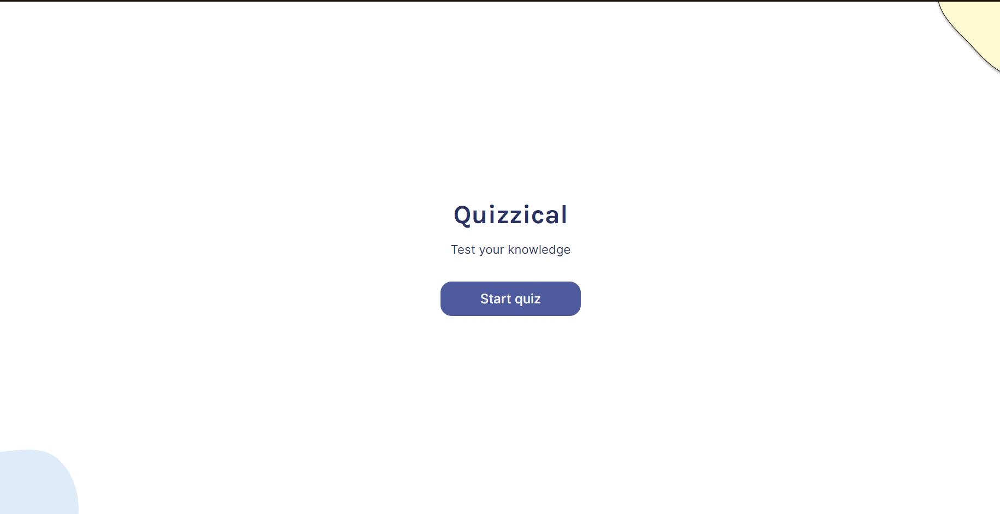
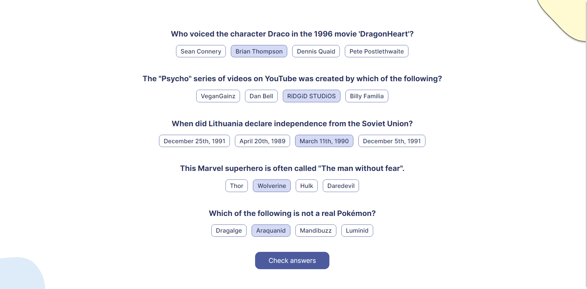
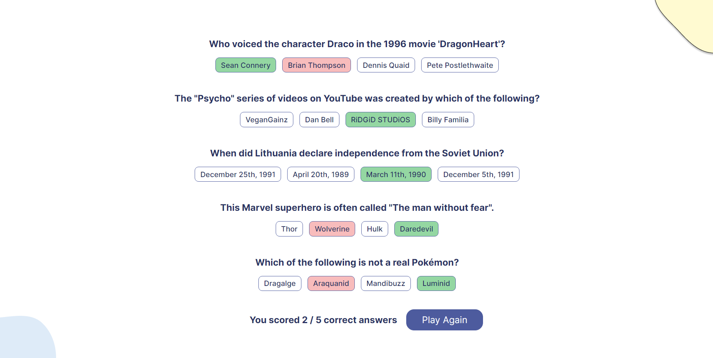

#  Quizzical Project

Quizzical Project from [Scrimba](https://scrimba.com/learn/frontend)'s React basics module.

## Project Link

[Project Link] quizzical-project-scrimba.netlify.app Hosted using Netlify 

## Previews

StarT Screen

Quiz

Results

## Project Functionality

- Generates a quiz of 5 questions using the Open Trivia Database API.
- Users can choose between 4 answers per question in which their selection while be highlighted.
- Once the check answers button is clicked, the results of the quiz will be displayed. Correct answers are highlighted green and incorrect answers are highlighted red.
- The users score is displayed and a play again button can be clicked to generate a new quiz.
